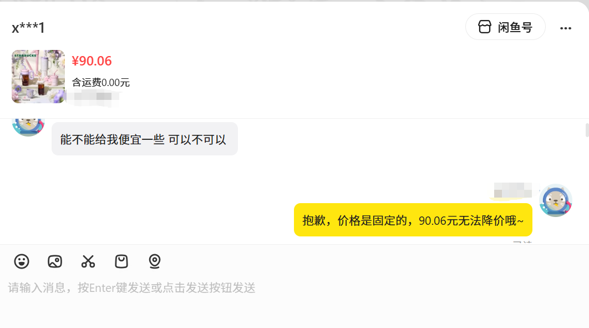
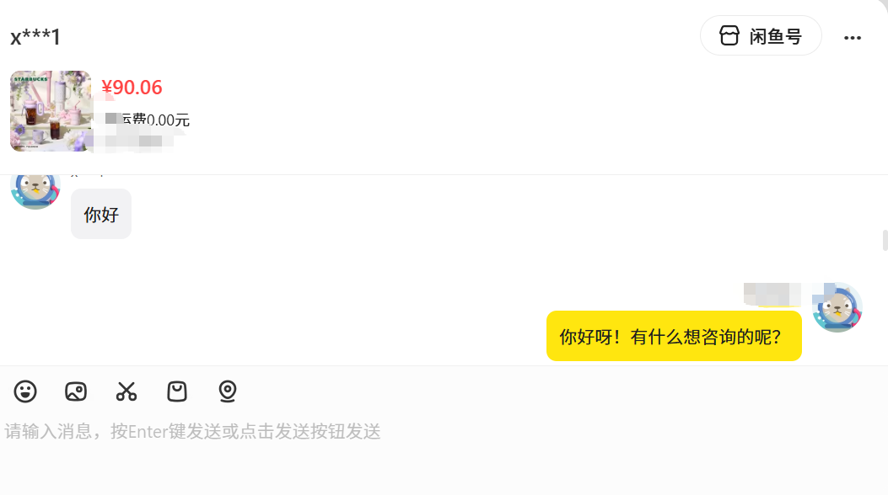

# 🐟 Xianyu AI Agent | 闲鱼多模态智能客服机器人


> **⚠️ 免责声明**：本项目是个人学习使用，仅供学习与技术交流使用。请勿用于商业用途或恶意刷单、发广告等违反平台规则的行为。

> 20260328 第一次更新，重新设计了记忆系统，并对代码进行模块化。 

基于大语言模型 (LLM) 与长短期记忆检索增强生成 (RAG) 构建的全自动闲鱼智能客服机器人。本项目通过逆向闲鱼底层 WebSocket 接口实现长连接通信，支持多模态（文本+图像）交互，并通过 LightRAG + Reranker + 智能激活策略 构建完整的记忆系统。

---


## 🚀 快速开始

### 1. 环境准备

本项目需要 Python 3.10+，首先克隆项目并安装依赖：

```bash
git clone https://github.com/yourusername/xianyubot1.git
cd xianyubot1
pip install -r requirements.txt
```

**注意**：如果使用 Reranker（BAAI/bge-reranker），需要额外安装：
```bash
pip install FlagEmbedding
# 或使用 CrossEncoder
pip install sentence-transformers
```

### 2. 环境变量配置

在项目根目录创建 `.env` 文件，配置以下内容：

```env
# ========== LLM 配置 ==========
# 支持 OpenAI 格式的接口（DeepSeek、Qwen、本地 API 等）
OPENAI_API_KEY=sk-xxxxxxxxxxxxxxxxxxxxxxxx
OPENAI_BASE_URL=https://api.openai.com/v1
LLM_MODEL=gpt-4o-mini

# ========== Embedding 配置 ==========
# 向量模型：留空使用本地 BGE 模型，否则使用远程 API
EMBEDDING_API_KEY=sk-xxxxxxxxxxxxxxxxxxxxxxxx
EMBEDDING_BASE_URL=https://api.openai.com/v1
EMBEDDING_MODEL=BAAI/bge-m3

# ========== 闲鱼 Cookie ==========
# 从网页版闲鱼登录后，F12 获取请求头中的完整 Cookie
COOKIES_STR="你的闲鱼完整Cookie字符串"

# ========== 其他配置 ==========
DEDUP_EXPIRE=60              # 消息去重过期时间（秒）
REPLY_COOLDOWN=10              # 同一用户防抖时间（秒）
```

### 3. 初始化数据库

```bash
# 可选：如需手动添加商品信息
# 编辑 item_info.txt，然后运行
python add_item_info.py
```

### 4. 启动机器人

```bash
python main.py
```

---

## 📸 对话示例

### 场景1：砍价询价



用户尝试砍价，机器人根据商品固定价格策略拒绝降价，并给出温和礼貌的回复。

### 场景2：常规咨询



用户初次接触，机器人及时响应并主动询问需求，展现积极主动的客服态度。

---

## 🔧 核心配置说明

### 长期记忆清理策略

在 `core/memory/cleanup_manager.py` 中配置：
```python
self.SHORT_TERM_LIMIT_PER_USER = 200    # 每用户保留最近 200 条
self.MID_TERM_DAYS = 30                 # 30 天内全保留
self.LONG_TERM_DAYS = 60                # 30-60 天有选择保留
self.DELETE_AFTER_DAYS = 60             # 60+ 天全删
```


---


## 🙏 致谢

本项目的诞生得益于开源社区的支持：

- **[shaxiu/XianyuAutoAgent](https://github.com/shaxiu/XianyuAutoAgent)**
  感谢原作者提供的闲鱼逆向工程底座
- **[HKUDS/LightRAG](https://github.com/HKUDS/LightRAG)**
  感谢香港大学数据智能实验室开源的 RAG 框架，是本项目长期记忆的核心

- **[BAAI](https://github.com/FlagOpen/FlagEmbedding)**
  感谢阿里巴巴开源的 BGE Embedding 和 Reranker 模型

---


## 📄 License

本项目采用 MIT 开源许可证，详见 [LICENSE](LICENSE) 文件。

---

**⭐ 如果这个项目对你有帮助，请给个 Star！**


